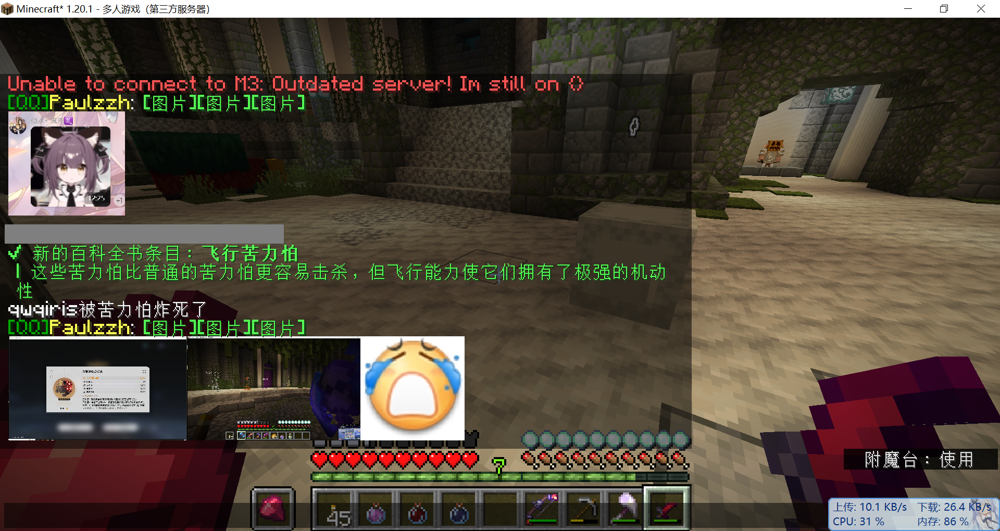

# 纯客户端的聊天栏图片直接显示Mod



## 特色

- 服务端无需任何更改，客户端安装即用
-
基于原版[/tellraw](https://zh.minecraft.wiki/w/%E6%96%87%E6%9C%AC%E7%BB%84%E4%BB%B6%E6%A0%BC%E5%BC%8F#%E7%82%B9%E5%87%BB%E4%BA%8B%E4%BB%B6)
的`clickEvent.open_url` 不自己造轮子
- 自动显示在聊天栏，无需中断游戏
- 图片缓存

## 用法

- 打开一个命令方块，粘贴以下内容([不会写点我](https://www.mcmod.cn/tools/cbcreator/#/tellraw/))

````
tellraw @a [{"text": "[\u56fe\u7247]", "color": "green", "clickEvent": {"action": "open_url", "value": "https://i.mcmod.cn/class/cover/20210220/1613753764_10167_HvjN.jpg"}},{"text": "[\u56fe\u7247]", "color": "green", "clickEvent": {"action": "open_url", "value": "https://webinput.nie.netease.com/img/mc/logo.png"}}]
````

- 会显示两张图片
- 或者从服务端控制台执行(
  比如Velocity上可以用[这个插件](https://github.com/OskarsMC-Plugins/broadcast)`/broadcast raw {json}`来广播 一样的)
- 直接从聊天栏输入会有长度限制注意

## 支持版本

| mod版本         | 加载器    | 兼容游戏版本                 |
|---------------|--------|------------------------|
| 1.16.5        | forge  | 1.16.5                 |
| 1.19.4        | fabric | 1.19.4                 |
| 1.20.1-1.20   | fabric | 1.20 1.20.1            |
| 1.20.4-1.20.2 | fabric | 1.20.2 1.20.3 1.20.4   |
| 1.21-1.20.5   | fabric | **1.21** 1.20.5 1.20.6 |

## 感谢

- 项目结构 [RealHeart/ZMusic-Mod](https://github.com/RealHeart/ZMusic-Mod)
-
代码参考 [MakesYT/chatsync](https://github.com/MakesYT/chatsync_mods_fabric) [MakesYT/chatsync](https://github.com/MakesYT/chatsync_mods_forge)
- 灵感来源 [Team-Fruit/SignPicture](https://github.com/Team-Fruit/SignPicture)

## 开源协议

本项目使用 [GPL-3.0](LICENSE) 协议开放源代码